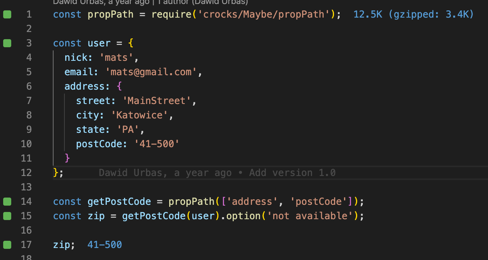
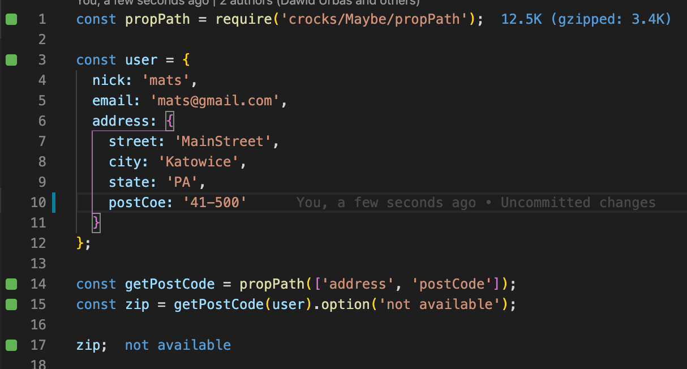

# Code for dx-deck presentation about the Maybe Monad

Runtime presented on preview is the QUOKKA.js which helps you tu run the code on as close to every line as possible.

Run and play around every js files in /step*/ directories
